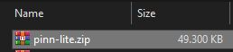

# SpotMicroPi

Hello, I'm Fran and i'm going to guide you in the steps needed for preparing your RaspberryPi to move your SpotMicro.

From now on, since you are going to use RaspBerryPi to power it, I will call it SpotMicroPi

In order to have SpotMicroPi moving we need to prepare its operating system in a SD card.

RaspberryPi fundation has written a very nice manual here: https://www.raspberrypi.org/documentation/installation/installing-images/ guiding you step by step.

But in this manual I'm going to do it a bit differently, I will drive you for an installation that don't need any screen, monitor and keyboard connected to your RaspberryPi to acomplish it. You just need a WIFI connection and or network cable connection.

This kind of installation is called headless.

The concept is very simple, in a nutshell, before we boot the RaspberryPi with our SD, the SD will have the network configuration (WIFI or nothing if you prefer to use network cable). Also will have the configuration needed to enable the services to access to it (VNC and SSH).

# SpotMicroPi platform

SpotMicroPi platform uses:
* 12 servos
* 2 PCA9685
* DC to DC Buck Converter LM2596 (also known as step down votage regulator)
* 2 7.4v batteries working in parallel
* A rocket switch
* 16x2 LCD Display Screen with I2C Module Interface Adapter

# Hardware requirements

This manual covers the installation of the operating system in the RaspberryPi, and letting it accesible wirelessly

* RaspberryPi 3 or newer recommended
* RaspberryPi power supply
* SD Card
* Wifi connection (or Ethernet)
* A computer like the one you are probably using to read this document

Nothing else, nothing more. All set then, lets go!

# RaspberryPi operating system

Raspbian is the official operating system for RaspberryPi. To simplify its installation and provide the user more options RaspberryPi fundation created NOOBS, which let you install other operating systems in the platform.

We are going to use PINN, the reason is that brings more options to the table if needed. PINN is a version of the NOOBS Operating System Installer for Raspberry Pi.

You can read all about it here: https://github.com/procount/pinn

## Step 1

PINN is just a compressed zip file that we must extract its contents in the SD card.

Download the .zip file that contains PINN from: http://sourceforge.net/projects/pinn/files/pinn-lite.zip

## Step 2

We need to format the SD card. Do this step even if the SD card is new.

In the RaspberryPi website, during the official installation guide, they recommend the following tool: https://www.sdcard.org/downloads/formatter/, and is the one you must use.

* Dowload the executable for your operating system.
* Install the "SD Card Formatter" tool that you just download
* Insert in the computer the SD card
* Run the "SD Card Formatter"
* Make sure you select the proper card (the tool is smart to show you only SD cards)
* Format the card (all defaults)

## Step 3

We need to put all PINN files in the SD card, is that simple!

* Unzip the pinn-lite.zip file you downloaded previously in the SD card

The SD card must look like similar to the following image:

