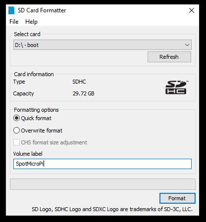
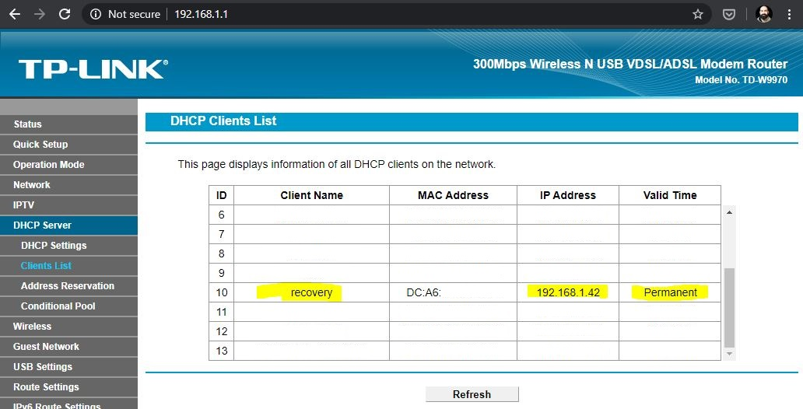
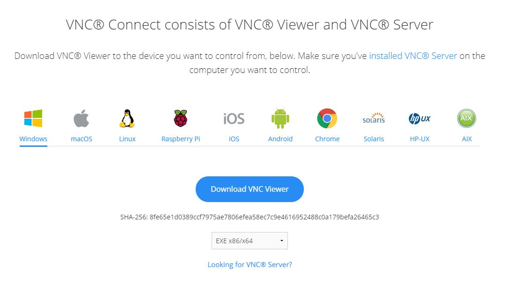

# SpotMicroPi

Hello, I'm Fran and i'm going to guide you in the steps needed for preparing your RaspberryPi to move your SpotMicro.

From now on, since you are going to use RaspBerryPi to power it, I will call it SpotMicroPi

In order to have SpotMicroPi moving we need to prepare its operating system in a SD card.

RaspberryPi fundation has written a very nice manual here: https://www.raspberrypi.org/documentation/installation/installing-images/ guiding you step by step.

But in this manual I'm going to do it a bit differently, I will drive you for an installation that don't need any screen, monitor and keyboard connected to your RaspberryPi to acomplish it. You just need a WIFI connection and or network cable connection.

This kind of installation is called headless.

The concept is very simple, in a nutshell, before we boot the RaspberryPi with our SD, the SD will have the network configuration (WIFI or nothing if you prefer to use network cable). Also will have the configuration needed to enable the services to access to it (VNC and SSH).

# SpotMicroPi platform

SpotMicroPi platform uses:
* 12 servos
* 2 PCA9685
* DC to DC Buck Converter LM2596 (also known as step down votage regulator)
* 2 7.4v batteries working in parallel
* A rocket switch
* 16x2 LCD Display Screen with I2C Module Interface Adapter

# Hardware requirements

This manual covers the installation of the operating system in the RaspberryPi, and letting it accesible wirelessly

* RaspberryPi 3 or newer recommended
* RaspberryPi power supply
* SD Card
* Wifi connection (or Ethernet)
* A computer like the one you are probably using to read this document

Nothing else, nothing more. All set then, lets go!

# RaspberryPi operating system

Raspbian is the official operating system for RaspberryPi. To simplify its installation and provide the user more options RaspberryPi fundation created NOOBS, which let you install other operating systems in the platform.

NOOBS is a small operating system that runs before your operating system (In this case before Raspbian) to let you install it in a very simple and convinient maner. But NOOBS has a problem, when you enable VNC for it, disables the external monitor.

We are going to use PINN, the reason is that brings more options to the table, like a convinient VNC implementation and advanced options if needed. PINN is a version of the NOOBS Operating System Installer for Raspberry Pi.

To summarize, we are going to use PINN to install RaspbianLite in our SD card without keyboard/mouse/screen attached to it.

You can read all about it here: https://github.com/procount/pinn

## Step 1

PINN is just a compressed zip file that we must extract its contents in the SD card.

Download the .zip file that contains PINN from: http://sourceforge.net/projects/pinn/files/pinn-lite.zip

## Step 2

We need to format the SD card. Do this step even if the SD card is new.

In the RaspberryPi website, during the official installation guide, they recommend the following tool: https://www.sdcard.org/downloads/formatter/, and is the one you must use.

* Dowload the executable for your operating system.
* Install the "SD Card Formatter" tool that you just download
* Insert in the computer the SD card
* Run the "SD Card Formatter"
* Make sure you select the proper card (the tool is smart to show you only SD cards)
* Format the card (all defaults)

## Step 3

We need to put all PINN files in the SD card, is that simple!

* Unzip the pinn-lite.zip file you downloaded previously in the SD card

The SD card must look like similar to the following image:

## Step 4

Is time to configure the PINN operating system to boot with VNC and SSH enabled, so we can access it using our network.

Doing this, we dont need mouse/keyboard/screen connected to our RaspberryPi, not even during the installation. But we can have them of course.

* Open the SD card
* Open the file recovery.cmdline with a proper text editor like Sublime Text or nano
* Add the following 2 words to the line present in the file:
** vncshare
** ssh

It will result in something like:

    runinstaller quiet ramdisk_size=32768 root=/dev/ram0 init=/init vt.cur_default=1 elevator=deadline repo_list=http://raw.githubusercontent.com/procount/pinn-os/master/os/repo_list.json loglevel=2 sdhci.debug_quirks2=4 vncshare ssh

* Save the file

## Step 5

Lets connect to the network!

If you don't have a WIFI network just plug the cable in the RaspberryPi and skip this step, but mind SpotMicroPi will need this cable to be "programmed" every time.

In order to enable the WIFI:

* Open the SD card
* Create a text file called wpa_supplicant.conf
* Write in the file the following lines

    country=us
    update_config=1
    ctrl_interface=/var/run/wpa_supplicant

    network={
     scan_ssid=1
     ssid="YOUR_WIFI_SSID_NAME_HERE"
     psk="SUPER_SECRET_PASSWORD"
    }

* Save the file

## Step 6

Lets boot the RaspberryPi

* Insert the SD card in the RaspberryPi
* Connect the power supply to the RaspberryPi
* Boot it

# Network access

Connecto to your Router and identify which IP has been assigned to your RaspberryPi.

For convenience you must add a IP Address reservation in your DCHP Server, so your RasberryPi IP will be always the same.

Every router is different, I'm affraid I cant help you more here.

The IP will look like something like 192.168.1.XX for an standard home router installation.

Once you know the IP ping to it to be sure you can reach it.

* Connect to your router (most likely 192.168.1.1)
* Identify the RaspberryPi in your list of WIFI clients
* From a console try to ping the ip
    
    ping 192.168.1.XX

* In your router homepage make the IP reservation to have it permanently assigned
* Save configuration

# Connect to the RaspberryPI via VNC

In order to see the PINN "virtual screen" that VNC provides, you need to install the VNC Viewer. VNC Viewer is a free to use software.

* Download VNC Viewer from https://www.realvnc.com/en/connect/download/viewer/
* Install VNC Viewer

PINN installing RasbianLite

Select the language