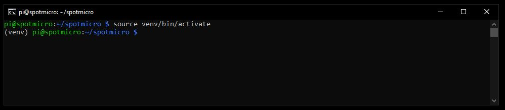
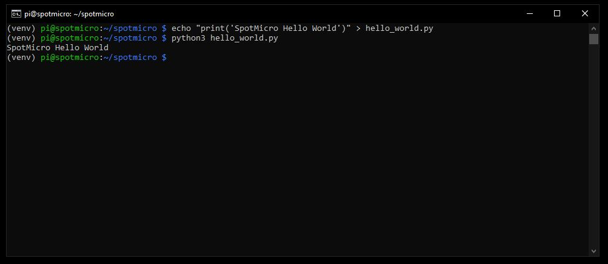
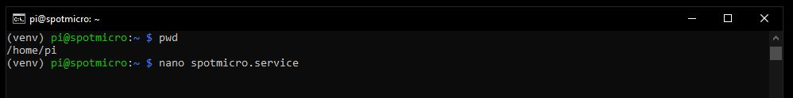
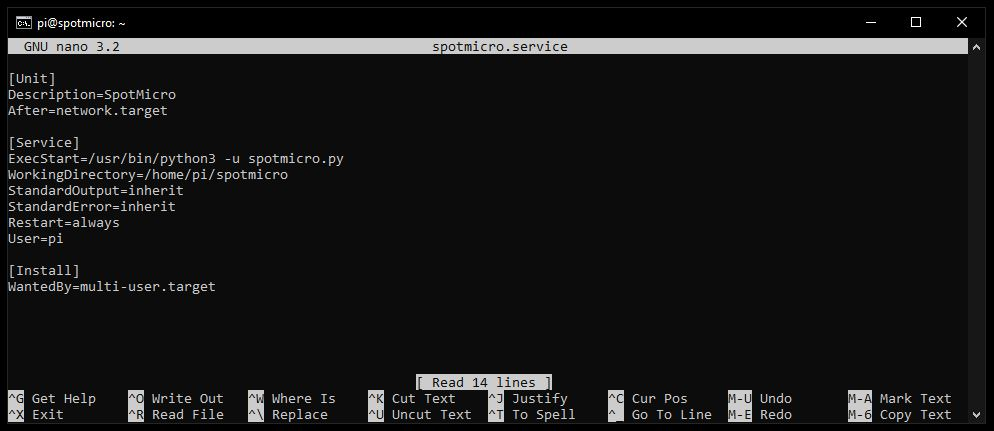
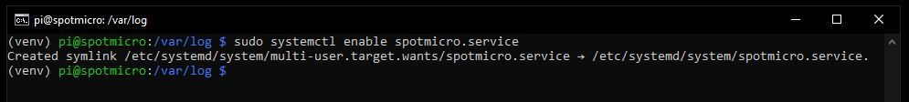
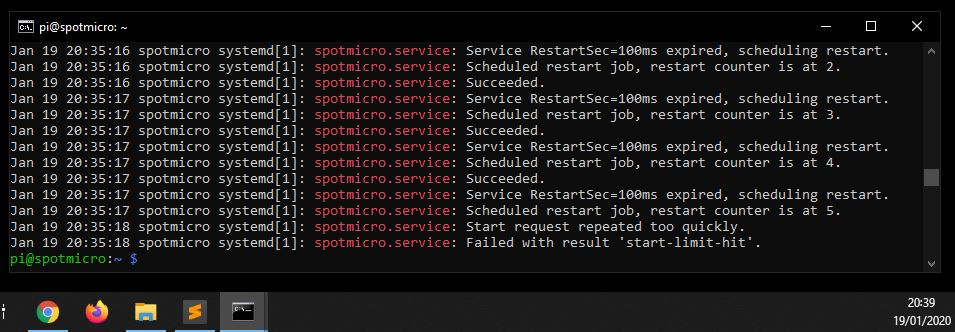
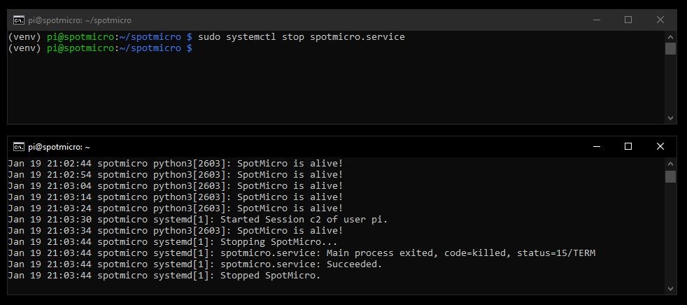

# SpotMicroAI

Hello, I'm Fran and i'm going to guide you in the steps needed for preparing your RaspberryPi to move your SpotMicroAI.

This part of the tutorial assume you already have the RaspberryPi ready to run a program.

# Hardware requirements for this tutorial

* RaspberryPi 3 or better (4 requires heatsink)

# Software requirements

* RaspbianLite installed and updated


# Creating our first python program

## Python 3 environment

Open a terminal to the RaspberryPi, remember your password is "spotmicro"

```
ssh pi@192.168.1.XX
```

Make sure youare in the home directory for the user "pi", the following command must return "/home/pi"

```
pwd
```

Lets start working on the program.

The program wil run as a daemon/service in the RaspberryPi, will start every time the SpotMicroAI get powered.

I'm using Python 3, since is very accesible to everyone and very decent language.

We will create the folder for the program now and start a Python 3 project

```
mkdir spotmicro
cd spotmicro

sudo apt-get install python3-venv -y
```

Create your Python3 environment in the spotmicro folder
```
python3 -m venv venv --clear
```

Activate your Python environment
```
source venv/bin/activate
```
Note the "(env)" in your terminal, that means you have the environment variables needed to run your programs in that folder (were we created the python environment)



Like Raspbian, Python has modules and packages, Raspbian (the OS) uses apt for update and install packages in the system (because is based in Debian), Python uses "pip".

Pip let you install modules in your programs that you can use, for example if you have the I2C 16x2 led screen, you will need its library installed in your Python 3 environment to make it work. Pip does that for you.

Some deprecated versions of Python had issues, to fix them all and avoid entering in problems with them just run the following commands:

```
curl https://bootstrap.pypa.io/get-pip.py | python

pip install --upgrade pip
pip install --upgrade setuptools
```

To deactivate the environment you can always write "deactivate" in your terminal.

And thats about it!, we are ready to create our first hello world python application!

## Python 3 hello world

Lets create fast just a **hello_world.py** file to print a message and see if all is working as expected.

```
cd /home/pi/spotmicro
echo '#!/home/pi/spotmicro/venv/bin/python3 -u' > hello_world.py
echo 'print("SpotMicro Hello World")' >> hello_world.py
python3 hello_world.py
```



# Running the program when the system boots

Go to the home directory, we are going to create there the .service file needed to tell RaspberryPi that our program is a service

```
cd /home/pi
mv /home/pi/spotmicro/hello_world.py /home/pi/spotmicro/spotmicro.py
chmod +x /home/pi/spotmicro/spotmicro.py
```

Create a text file called **spotmicro.service** with the following contents:

```
[Unit]
Description=SpotMicro
After=network.target

[Service]
Type=simple
ExecStart=/home/pi/spotmicro/spotmicro.py
WorkingDirectory=/home/pi/spotmicro/venv
StandardOutput=inherit
StandardError=inherit
Restart=always
User=pi

[Install]
WantedBy=multi-user.target
```

You can use nano editor for this task

```
nano spotmicro.service
```


(the contents of the picture are just an example, use the content described and updated in the page, above)


Now we need to move the spotmicro.service file to the system directory (we use sudo because the system directory belongs to root)

```
sudo mv spotmicro.service /etc/systemd/system/spotmicro.service
```

Now we can try to run it, this is necessary to see if there is something wrong in the script or configuration

```
sudo systemctl start spotmicro.service
```

We can see if it was ran checking the daemon.log logs

```
cat /var/log/daemon.log
```

Our program is not a "service/daemon" yet so it will "fail to start", but will be run. The following lines show it ran successfully.

```
Jan 19 20:27:46 spotmicro python3[9949]: SpotMicro Hello World
Jan 19 20:27:46 spotmicro systemd[1]: spotmicro.service: Succeeded.
Jan 19 20:27:46 spotmicro systemd[1]: spotmicro.service: Service RestartSec=100ms expired, scheduling restart.
Jan 19 20:27:46 spotmicro systemd[1]: spotmicro.service: Scheduled restart job, restart counter is at 5.
Jan 19 20:27:46 spotmicro systemd[1]: Stopped SpotMicro.
Jan 19 20:27:46 spotmicro systemd[1]: spotmicro.service: Start request repeated too quickly.
Jan 19 20:27:46 spotmicro systemd[1]: spotmicro.service: Failed with result 'start-limit-hit'.
Jan 19 20:27:46 spotmicro systemd[1]: Failed to start SpotMicro.
```

Lets enable it so it will run every time the machine starts

```
sudo systemctl enable spotmicro.service
```



Lets reboot the RaspberryPi and check if it ran the spotmicro.py script in the logs. Mind than after reboot, it will kick us out from the console connection and we need to reconnect

```
sudo reboot
```

```
ssh pi@192.168.1.XX
cat /var/log/daemon.log | grep -i 'spotmicro'
```

If it shows the following lines with the times near to the minute that takes to reboot the RaspberryPi, all is working correctly.

```
Jan 19 20:35:17 spotmicro systemd[1]: spotmicro.service: Succeeded.
Jan 19 20:35:17 spotmicro systemd[1]: spotmicro.service: Service RestartSec=100ms expired, scheduling restart.
Jan 19 20:35:17 spotmicro systemd[1]: spotmicro.service: Scheduled restart job, restart counter is at 5.
Jan 19 20:35:18 spotmicro systemd[1]: spotmicro.service: Start request repeated too quickly.
Jan 19 20:35:18 spotmicro systemd[1]: spotmicro.service: Failed with result 'start-limit-hit'.
```




# Making the program a real linux service

Raspbian uses systemd, which makes the old "daemonization" used by init.d obsolete.


```
cd /home/pi/spotmicro
source venv/bin/activate

nano spotmicro.py
```

This is the contents of your first service!
Every 10 seconds we will write in the daemons log a text, so we can validate the service is alive.
Also we can try to stop and start it while looking at the logs.

```
#!/home/pi/spotmicro/venv/bin/python3 -u

import time                                                  


while True:
    print('SpotMicro is alive!')
    time.sleep(10)   
```

Restart the service

```
sudo systemctl daemon-reload; sudo systemctl restart spotmicro.service
```

Open a second terminal and run the following command so you can see the logs appearing and stopping when we stop the daemon.
You can press Control+C to cancel the watch of the logs

```
ssh pi@192.168.1.XX
tail -f /var/log/daemon.log
```

In the first terminal you can run the following scripts to see how the daemon stops and start successfully

```
sudo systemctl stop spotmicro.service
sudo systemctl start spotmicro.service
```




# SpotMicroAI

**You are all set!**

Now your SpotMicroAI has a soul and brain.
We need a convinient way of sending files to it, so, we can work our program fast.
