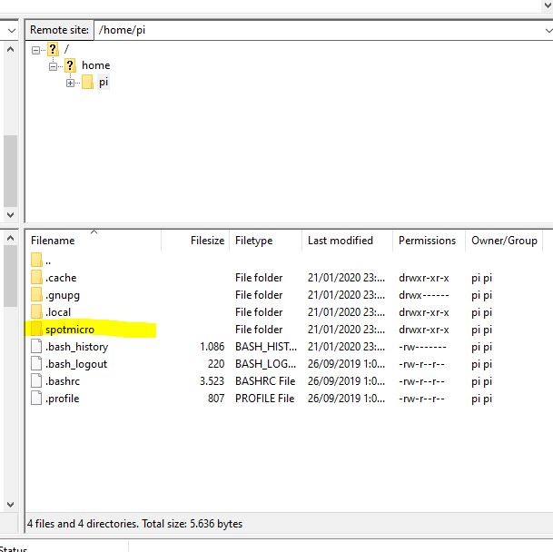

# SpotMicroAI

Hello, I'm Fran and i'm going to guide you in the steps needed for preparing your RaspberryPi to move your SpotMicro.

This part of the tutorial assume you already have the RaspberryPi with a linux service, a simple python that starts when the SpotMicro starts

# Transfering files in and out

We have enabled the SSH service in our SpotMicro, so, we are ready to transfer files to it and from it to our computer conviniently.

To do so we are going to use a software called FileZilla Client, you can download it from: https://filezilla-project.org/download.php?type=client

FileZilla Client installation may suggest you to install third party software, skip it. We just need FileZilla Client.

Open the client to see it, it has 2 sides


* Left side is your local computer
* Right side is your SpotMicro

Write your SpotMicro ip address, user **pi**, password **spotmicro**, port **22** and press QuickConnect!


FileZilla will offer you to save the password, go for it.

You will see the SpotMicro folders in the right panel



Double click in the folder **spotmicro** to see its contents, you can drag and drop files there.

Remember the file spotmicro.py will be run as a service everytime the SpotMicro boots.

# Update a file

## Download the spotmicro.py file to your desktop:

* In the left panel look for your Desktop folder, most likelly something like: C:\Users\USERNAME\Desktop\
* Drag and drop the file **spotmicro.py** from the right panel to the left panel.

Edit it with a proper text editor like Sublime Text (https://www.sublimetext.com/3)

Change its contents to:

```
#!/home/pi/spotmicro/venv/bin/python3 -u

import time


while True:
    print('SpotMicro is alive and updated!')
    time.sleep(60)
```

## Upload the **spotmicro.py** file to your SpotMicro:

* Drag and drop the file **spotmicro.py** from the left panel to the right panel.


## Check than the change is running

Open a terminal in SpotMicro and run the following command so you can see the updated logs appearing every 60 seconds:

You can press Control+C to cancel the watch of the logs

```
ssh pi@192.168.1.XX
tail -f /var/log/daemon.log
```

# SpotMicroAI

**You are all set!**

Your SpotMicroAI has a soul and brain.
We need to test all output and motion devices connected to the RaspberryPi (Screen, servos), also we need to receive signals from our Bluetooth XBox/PS4 controller
