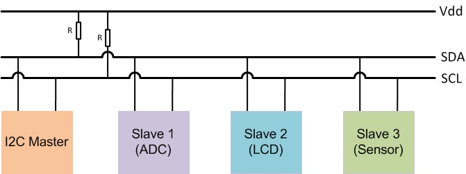
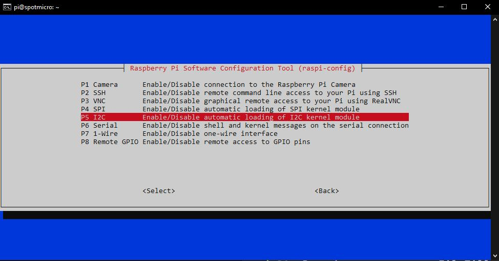
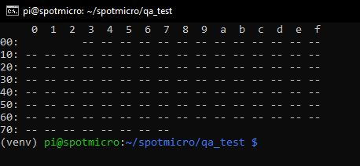
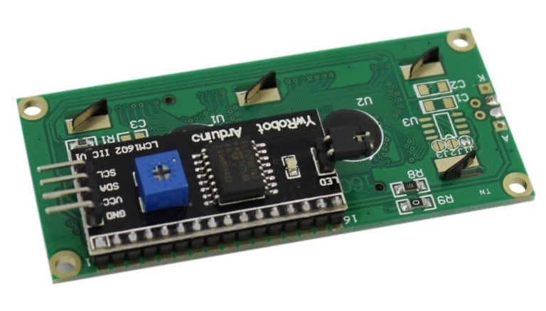

# SpotMicroAI

Hello, I'm Fran and i'm going to guide you in the steps needed for preparing your RaspberryPi to move your SpotMicro.

We are going to test 3 hardware parts using our program, to familiaryze ourselves with them:

* Screen
* Servos
* Bluetooth controller
  * XBox controller test
  * PS4 controller test

# Hardware requirements

* RaspberryPi 3 or newer recommended
* RaspberryPi power supply
* SD Card with Raspbian Lite
* Wifi connection (or Ethernet)
* A computer like the one you are probably using to read this document

* The Servos connected to a PCA96xx board, and the PCA96xx board connected to the RaspberryPi using I2C
* The Screen connected to the RaspberryPi using I2C
* XBox/PS4 controller connected to the RaspberryPi using Bluetooth

Nothing else, nothing more. All set then, lets go!

# Prepare the system

Remember you can use FileZilla or terminal to navigate and update the files in SpotMicroAI.

To run the tests you need to use the terminal.

## Enable I2C

I2C is a communication bus that let us connect in serial (daisy connection) many devices.

RaspberryPI has I2C bus capabilities and it also has the needed pull up resistors build in, so we just need to connect to it the devices.



Every connected device must have a different I2C address, usually if you have 2 of the very same board you need to sold a pin or reconfigure a jumper to change in one of them its I2C hardware address.

Open a terminal and run the following commands
```
ssh pi@192.168.1.XX
sudo raspi-config
```

And from the options presented, do the following changes:

* Interfacing options
  * Enable I2C



* Select Finish and accept the reboot option

We are still missing a couple of tools that will help us to identify and test the components present in the I2C bus and use them in python.

```
ssh pi@192.168.1.XX
sudo apt-get install i2c-tools python-smbus -y
sudo reboot
```

* i2c-tools lists the connected devices to the i2c bus
* python-smbus let us use i2c components in Python

## List all I2C devices connected

Use the following command when you have any device connected to I2C to know its address. We will need the address in our Python script later to use it.

```
ssh pi@192.168.1.XX
i2cdetect -y 1
```

Will be empty for now:



## Creating the QA tests

Once the reboot finishes, login again, open a terminal and run the following commands
```
cd spotmicro
source venv/bin/activate

mkdir qa_test
cd qa_test/

mkdir screen
mkdir servos
mkdir xboxcontroller
mkdir ps4controller
```

# Testing the Screen

TODO:
* Following: http://www.circuitbasics.com/raspberry-pi-i2c-lcd-set-up-and-programming/
* https://gitlab.com/custom_robots/spotmicro/raspberrypi/tree/master/4.%20Test%20your%20components%20individually/raw_tests/screen_tests


Connecting an LCD with an I2C interface is very simple, connect the SDA pin on the screen to the SDA on the PI, and the SCL pin on the Pi to the SCL pin on the LCD. The ground and Vcc pins will also need to be connected. Most LCDs can operate with 3.3V, but they’re meant to be run on 5V, so connect it to the 5V pin of the Pi if possible.




# Testing the Servos

TODO:
* Following: https://github.com/adafruit/Adafruit_Python_PCA9685
* PDF: https://cdn-learn.adafruit.com/downloads/pdf/adafruit-16-channel-servo-driver-with-raspberry-pi.pdf
* https://gitlab.com/custom_robots/spotmicro/raspberrypi/tree/master/4.%20Test%20your%20components%20individually/raw_tests/servos_tests

# Testing the XBox controller

TODO:
* https://pimylifeup.com/xbox-controllers-raspberry-pi/
* https://gist.github.com/rdb/8864666
* https://gitlab.com/custom_robots/spotmicro/raspberrypi/tree/master/4.%20Test%20your%20components%20individually/raw_tests/xboxcontroller

# Testing the PS4 controller

TODO:
* DS4 driver