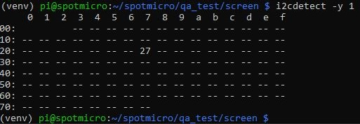
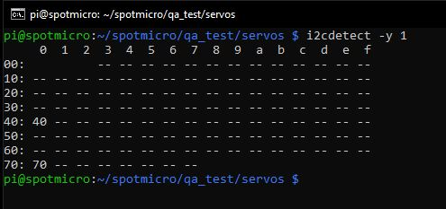

# SpotMicroAI

Hello, I'm Fran and i'm going to guide you in the steps needed for preparing your RaspberryPi to move your SpotMicro.

We are going to test 3 hardware parts using our program, to familiaryze ourselves with them:

* Screen
* Servos
* Bluetooth controller
  * XBox controller test
  * PS4 controller test

# Hardware requirements

* RaspberryPi 3 or newer recommended
* RaspberryPi power supply
* SD Card with Raspbian Lite
* Wifi connection (or Ethernet)
* A computer like the one you are probably using to read this document
* The Servos connected to a PCA96xx board, and the PCA96xx board connected to the RaspberryPi using I2C
* The LCD 16x2 I2C Screen connected to the RaspberryPi
* XBoxOne/PS4 controller connected to the RaspberryPi using Bluetooth

Nothing else, nothing more. All set then, lets go!

# Prepare the system

Remember you can use FileZilla or terminal to navigate and update the files in SpotMicroAI.

To run the tests you need to use the terminal.

## Enable I2C

I2C is a communication bus that let us connect in serial (daisy connection) many devices.

RaspberryPI has I2C bus capabilities and it also has the needed pull up resistors build in, so we just need to connect to it the devices.


Every connected device must have a different I2C address, usually if you have 2 of the very same board you need to sold a pin or reconfigure a jumper to change in one of them its I2C hardware address.

Open a terminal and run the following commands
```
ssh pi@192.168.1.XX
sudo raspi-config
```

And from the options presented, do the following changes:

* Interfacing options
  * Enable I2C


* Select Finish and accept the reboot option

We are still missing a couple of tools that will help us to identify and test the components present in the I2C bus and use them in python.

```
ssh pi@192.168.1.XX
sudo apt-get install i2c-tools python-smbus -y
sudo reboot
```

* i2c-tools lists the connected devices to the i2c bus
* python-smbus let us use i2c components in Python

## List all I2C devices connected

Use the following command when you have any device connected to I2C to know its address. We will need the address in our Python script later to use it.

```
ssh pi@192.168.1.XX
i2cdetect -y 1
```

Will be empty for now:


## Creating the QA tests

Once the reboot finishes, login again, open a terminal and run the following commands
```
cd spotmicro
source venv/bin/activate

mkdir qa_test
cd qa_test/

mkdir screen
mkdir servos
mkdir xboxonecontroller
mkdir ps4controller
```
# RaspberryPi GPIO


More on this here: https://www.raspberrypi.org/documentation/usage/gpio/

# Testing the Screen

## Connecting the Screen to I2C

Connecting an LCD with an I2C interface is very simple:
* Connect the SDA pin on the screen to the SDA on the PI <- I2C data
* Connect the SCL pin on the screen to the SCL on the PI <- I2c clock signal
* Connect the Vcc pin on the screen to the 5V on the PI
* Connect the GND pin on the screen to the GND on the PI


And run the detection to see if is correctly connected and detected:

```
i2cdetect -y 1
```



As you can see the I2C address is 27 in the table. You may have different address.

## Libraries

We are going to use an improved version of a I2C library that was published first here: https://www.recantha.co.uk/blog/?p=4849.

The library is located here: https://gist.github.com/DenisFromHR/cc863375a6e19dce359d

* Download the library file from our repository and the example using the terminal with the following command:
Save the needed library in our repo, link it to the source but keep the copy.
```
cd /home/pi/spotmicro/qa_test/screen

curl -o /home/pi/spotmicro/qa_test/screen/screen_tests.py https://gitlab.com/custom_robots/spotmicro/raspberrypi/raw/master/4.%20Test%20your%20components%20individually/LCD_16x2_I2C_Screen/screen_tests.py

curl -o /home/pi/spotmicro/qa_test/screen/RPi_LCD_16x2_I2C_driver.py https://gitlab.com/custom_robots/spotmicro/raspberrypi/raw/master/4.%20Test%20your%20components%20individually/LCD_16x2_I2C_Screen/RPi_LCD_16x2_I2C_driver.py

sed -i 's/unichr/chr/g' screen_tests.py

cd /home/pi/spotmicro
source venv/bin/activate
cd qa_test/screen

python3 -m pip install smbus

python3 screen_tests.py
```

* Remember you can use FileZilla if you prefer a graphical environment

**Look at your screen!**

If you mist the action run again while stearing at our screen!

```
python3 screen_tests.py
```

## Run some simple tests

* [screen_tests_write_to_display.py](https://gitlab.com/custom_robots/spotmicro/raspberrypi/blob/master/4.%20Test%20your%20components%20individually/LCD_16x2_I2C_Screen/screen_tests_write_to_display.py)
* [screen_tests_position_the_text.py](https://gitlab.com/custom_robots/spotmicro/raspberrypi/blob/master/4.%20Test%20your%20components%20individually/LCD_16x2_I2C_Screen/screen_tests_position_the_text.py)
* [screen_tests_clear_the_screen.py](https://gitlab.com/custom_robots/spotmicro/raspberrypi/blob/master/4.%20Test%20your%20components%20individually/LCD_16x2_I2C_Screen/screen_tests_clear_the_screen.py)
* [screen_tests_blinking_text.py](https://gitlab.com/custom_robots/spotmicro/raspberrypi/blob/master/4.%20Test%20your%20components%20individually/LCD_16x2_I2C_Screen/screen_tests_blinking_text.py)
* [screen_tests_print_raspberrypi_temperature.py](https://gitlab.com/custom_robots/spotmicro/raspberrypi/blob/master/4.%20Test%20your%20components%20individually/LCD_16x2_I2C_Screen/screen_tests_print_raspberrypi_temperature.py)
* [screen_tests_print_the_date_and_time.py](https://gitlab.com/custom_robots/spotmicro/raspberrypi/blob/master/4.%20Test%20your%20components%20individually/LCD_16x2_I2C_Screen/screen_tests_print_the_date_and_time.py)
* [screen_tests_print_your_wifi_ip_address.py](https://gitlab.com/custom_robots/spotmicro/raspberrypi/blob/master/4.%20Test%20your%20components%20individually/LCD_16x2_I2C_Screen/screen_tests_print_your_wifi_ip_address.py)
* [screen_tests_scroll_text_right_to_left_continously.py](https://gitlab.com/custom_robots/spotmicro/raspberrypi/blob/master/4.%20Test%20your%20components%20individually/LCD_16x2_I2C_Screen/screen_tests_scroll_text_right_to_left_continously.py)
* [screen_tests_scroll_text_right_to_left_once.py](https://gitlab.com/custom_robots/spotmicro/raspberrypi/blob/master/4.%20Test%20your%20components%20individually/LCD_16x2_I2C_Screen/screen_tests_scroll_text_right_to_left_once.py)
* [screen_tests_scroll_text_left_to_right_once.py](https://gitlab.com/custom_robots/spotmicro/raspberrypi/blob/master/4.%20Test%20your%20components%20individually/LCD_16x2_I2C_Screen/screen_tests_scroll_text_left_to_right_once.py)

Create your custom characters here: https://omerk.github.io/lcdchargen/

* [screen_tests_print_single_custom_character.py](https://gitlab.com/custom_robots/spotmicro/raspberrypi/blob/master/4.%20Test%20your%20components%20individually/LCD_16x2_I2C_Screen/screen_tests_print_single_custom_character.py)
* [screen_tests_print_multiple_custom_characters.py](https://gitlab.com/custom_robots/spotmicro/raspberrypi/blob/master/4.%20Test%20your%20components%20individually/LCD_16x2_I2C_Screen/screen_tests_print_multiple_custom_characters.py)

You can use the following lines to download them and run them

```
curl -o /home/pi/spotmicro/qa_test/screen/screen_tests_write_to_display.py https://gitlab.com/custom_robots/spotmicro/raspberrypi/raw/master/4.%20Test%20your%20components%20individually/LCD_16x2_I2C_Screen/screen_tests_write_to_display.py

curl -o /home/pi/spotmicro/qa_test/screen/screen_tests_position_the_text.py https://gitlab.com/custom_robots/spotmicro/raspberrypi/raw/master/4.%20Test%20your%20components%20individually/LCD_16x2_I2C_Screen/screen_tests_position_the_text.py

curl -o /home/pi/spotmicro/qa_test/screen/screen_tests_clear_the_screen.py https://gitlab.com/custom_robots/spotmicro/raspberrypi/raw/master/4.%20Test%20your%20components%20individually/LCD_16x2_I2C_Screen/screen_tests_clear_the_screen.py

curl -o /home/pi/spotmicro/qa_test/screen/screen_tests_blinking_text.py https://gitlab.com/custom_robots/spotmicro/raspberrypi/raw/master/4.%20Test%20your%20components%20individually/LCD_16x2_I2C_Screen/screen_tests_blinking_text.py

curl -o /home/pi/spotmicro/qa_test/screen/screen_tests_print_raspberrypi_temperature.py https://gitlab.com/custom_robots/spotmicro/raspberrypi/raw/master/4.%20Test%20your%20components%20individually/LCD_16x2_I2C_Screen/screen_tests_print_raspberrypi_temperature.py

curl -o /home/pi/spotmicro/qa_test/screen/screen_tests_print_the_date_and_time.py https://gitlab.com/custom_robots/spotmicro/raspberrypi/raw/master/4.%20Test%20your%20components%20individually/LCD_16x2_I2C_Screen/screen_tests_print_the_date_and_time.py

curl -o /home/pi/spotmicro/qa_test/screen/screen_tests_print_your_wifi_ip_address.py https://gitlab.com/custom_robots/spotmicro/raspberrypi/raw/master/4.%20Test%20your%20components%20individually/LCD_16x2_I2C_Screen/screen_tests_print_your_wifi_ip_address.py

curl -o /home/pi/spotmicro/qa_test/screen/screen_tests_scroll_text_right_to_left_continously.py https://gitlab.com/custom_robots/spotmicro/raspberrypi/raw/master/4.%20Test%20your%20components%20individually/LCD_16x2_I2C_Screen/screen_tests_scroll_text_right_to_left_continously.py

curl -o /home/pi/spotmicro/qa_test/screen/screen_tests_scroll_text_right_to_left_once.py https://gitlab.com/custom_robots/spotmicro/raspberrypi/raw/master/4.%20Test%20your%20components%20individually/LCD_16x2_I2C_Screen/screen_tests_scroll_text_right_to_left_once.py

curl -o /home/pi/spotmicro/qa_test/screen/screen_tests_scroll_text_left_to_right_once.py https://gitlab.com/custom_robots/spotmicro/raspberrypi/raw/master/4.%20Test%20your%20components%20individually/LCD_16x2_I2C_Screen/screen_tests_scroll_text_left_to_right_once.py

curl -o /home/pi/spotmicro/qa_test/screen/screen_tests_print_single_custom_character.py https://gitlab.com/custom_robots/spotmicro/raspberrypi/raw/master/4.%20Test%20your%20components%20individually/LCD_16x2_I2C_Screen/screen_tests_print_single_custom_character.py

curl -o /home/pi/spotmicro/qa_test/screen/screen_tests_print_multiple_custom_characters.py https://gitlab.com/custom_robots/spotmicro/raspberrypi/raw/master/4.%20Test%20your%20components%20individually/LCD_16x2_I2C_Screen/screen_tests_print_multiple_custom_characters.py
```


# Testing the Servos

## First, lets use just RaspberryPi GPIO to check them 

Connect the servo as the image shows:


Download the following test to center the servo
```
cd /home/pi/spotmicro
source venv/bin/activate

cd /home/pi/spotmicro/qa_test/servos

python3 -m pip install RPi.GPIO

curl -o /home/pi/spotmicro/qa_test/servos/servo_test_all_positions.py https://gitlab.com/custom_robots/spotmicro/raspberrypi/raw/master/4.%20Test%20your%20components%20individually/RPi.GPIO_Servos/servo_test_all_positions.py

curl -o /home/pi/spotmicro/qa_test/servos/servo_test_position_to_center.py https://gitlab.com/custom_robots/spotmicro/raspberrypi/raw/master/4.%20Test%20your%20components%20individually/RPi.GPIO_Servos/servo_test_position_to_center.py

cp ../screen/RPi_LCD_16x2_I2C_driver.py .
```
Run with

```
python3 servo_test_all_positions.py
```
and
```
python3 servo_test_position_to_center.py
```

More details here: https://rpi.science.uoit.ca/lab/servo/

## Now lest use the module Adafruit_Python_PCA9685

Connect the servo as the image shows:


You can power the servo from the V+ pin, at 5V, or as the image shows, using the big side connector

 **Don't connect 5V to the Vcc which only accepts 3.3**, or your board will die.

After connecting it, check if the board has been detected properly
```
sudo i2cdetect -y 1
```



The 40 and 70 mean the module has been detected. You may have different address.

Download the following test to center the servo
```
cd /home/pi/spotmicro
source venv/bin/activate

cd /home/pi/spotmicro/qa_test/servos

python3 -m pip install adafruit-pca9685

curl -o /home/pi/spotmicro/qa_test/servos/XXXXXXXXXXXXXX.py https://gitlab.com/custom_robots/spotmicro/raspberrypi/raw/master/4.%20Test%20your%20components%20individually/RPi.GPIO_Servos/XXXXXXXXXXXXXX.py
```
Run with

```
python3 XXXXXXXXXXXXXX.py
```


More details here: https://learn.adafruit.com/adafruit-16-channel-servo-driver-with-raspberry-pi


TODO:
* Following: https://github.com/adafruit/Adafruit_Python_PCA9685
* PDF: https://cdn-learn.adafruit.com/downloads/pdf/adafruit-16-channel-servo-driver-with-raspberry-pi.pdf
* https://gitlab.com/custom_robots/spotmicro/raspberrypi/tree/master/4.%20Test%20your%20components%20individually/raw_tests/servos_tests


https://github.com/adafruit/Adafruit_Python_PCA9685/blob/master/examples/simpletest.py


# Testing the XBox One controller

TODO:
* https://pimylifeup.com/xbox-controllers-raspberry-pi/
* https://gist.github.com/rdb/8864666
* https://gitlab.com/custom_robots/spotmicro/raspberrypi/tree/master/4.%20Test%20your%20components%20individually/raw_tests/xboxcontroller

# Testing the PS4 controller

TODO:
* DS4 driver


https://github.com/RetroPie/RetroPie-Setup/wiki/PS4-Controller
https://github.com/chrippa/ds4drv

