# Development environment with RaspberryPi

I decided to have a second RaspberryPi 4 4GB with an external SSD USB3 as a development environment.

I've designed the case for it: https://www.thingiverse.com/thing:4105150

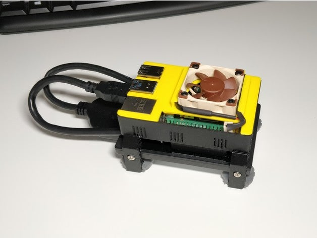

At the time of writing this, RaspberryPi 4 don't have support to boot from USB3, so you need to install the OS from a SD card and change the /boot partition or let PINN do it for you.

## USB3 don't recognizes your SSD (or SSD enclosure)

Disable UASP for that unit.

Altho I'm not using an ssd enclosure, I want to note her than another problem of RaspberryPi 4, with some USB enclosures without UASP support will not work if they are connected to USB3, you can do the installation to the USB2 and then modify the /boot partition to accomodate them.
How to solve it here:
* https://www.raspberrypi.org/forums/viewtopic.php?f=28&t=245931
* https://www.raspberrypi.org/forums/viewtopic.php?f=28&t=245323
* https://www.raspberrypi.org/forums/viewtopic.php?t=245767

In a nutsheel:
* Boot your ssd from USB2 port
* sudo nano /boot/cmdline.txt (that will be in your SD card)
* Add this at the end of the line: usb-storage.quirks=aaaa:bbbb:u
* lsusb will tell you the value of "aaaa:bbbb"

For example, my cmdline.txt if I was using an external enclosure, from:

```
console=serial0,115200 console=tty1 root=PARTUUID=d9b3f436-02 rootfstype=ext4 elevator=deadline fsck.repair=yes rootwait quiet splash plymouth.ignore-serial-consoles
```

will become:

```
console=serial0,115200 console=tty1 root=PARTUUID=d9b3f436-02 rootfstype=ext4 elevator=deadline fsck.repair=yes rootwait quiet splash plymouth.ignore-serial-consoles usb-storage.quirks=357d:7788:u
```

If you buy a brand new USB3 enclosure make sure it is UASP Compatible, so you can get the maximum from it.

## SSD in USB3, UASP and PINN

If you are using PINN, when you create the SD card, just add the "usb-storage.quirks=aaaa:bbbb:u" in the recovery.cmdline file, first line:

```
runinstaller quiet ramdisk_size=32768 root=/dev/ram0 init=/init vt.cur_default=1 elevator=deadline repo_list=http://raw.githubusercontent.com/procount/pinn-os/master/os/repo_list.json loglevel=2 sdhci.debug_quirks2=4 usb-storage.quirks=357d:7788:u vncshare ssh
```

## Installing the development environment (Headless)

Get familiar with the instructions in the followin link, then keep reading, but instead of RaspbianLite, install Raspbian Desktop (not the full version): https://gitlab.com/custom_robots/spotmicro/raspberrypi/tree/master/1.%20Prepare%20your%20RaspberryPi%20for%20SpotMicro

Make sure your SSD is also formatted, and free of partitions.

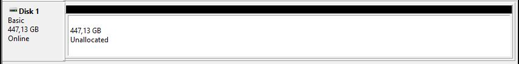

Raspbian installer will not expand the SSD partition automatically, since is not a SD card, so, we will have to do it manually after installing Raspbian on it.

Select:

* Tab General -> Raspbian
* Destination drive -> sda
* Your keyboard layout
* Language is not important, Raspbian will come with en_GB no matter what you select.

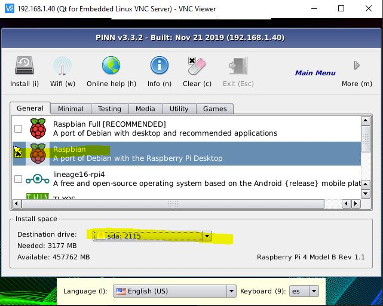


### Enable VNC and first boot

```
ssh pi@192.168.1.XX
sudo raspi-config
```

* Advanced options -> Resolution -> Pick one (1920x1080 60Hz in my case)
* Boot Options -> Desktop / CLI -> Desktop Autologin
* Interfacing options -> VNC
* Network Options -> Hostname -> "spotmicrodev" (to avoid collision with spotmicro used in the RaspberryPi located in the printed SpotMicro)
* Localization options -> Change locale
  * Remove en_GB.UTF-8 UTF-8
  * Select en_US.UTF-8 UTF-8
    * Default locale for system environment: en_US.UTF-8

Select Finish -> Reboot

### Updates

```
ssh pi@192.168.1.XX
sudo raspi-config
```

* Update

```
sudo apt install gparted
sudo apt update -y; sudo apt upgrade -y; sudo apt autoremove -y
sudo reboot
```

## VNC first login

Log in

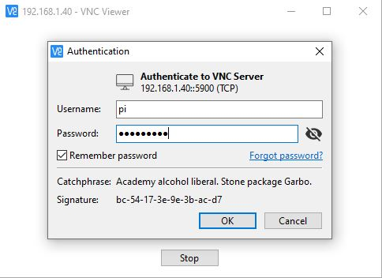

Welcome to your desktop

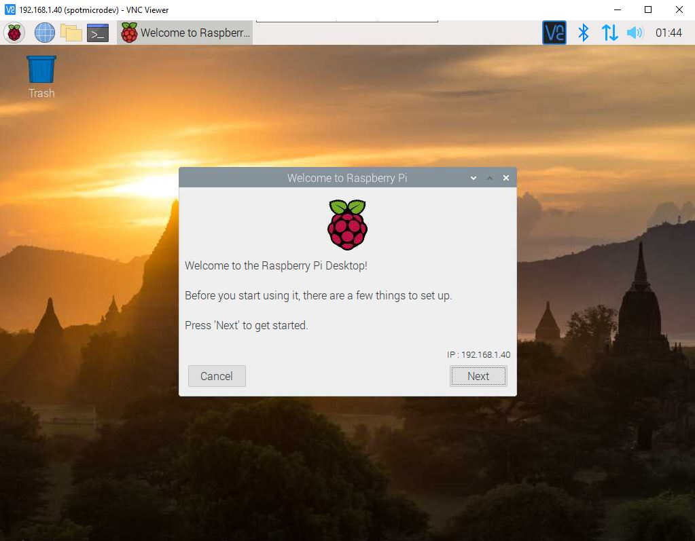

Remove the boot wizard

```
sudo rm /etc/xdg/autostart/piwiz.desktop
```

Open GParted


Select /dev/sda instead of /dev/mmcblk0

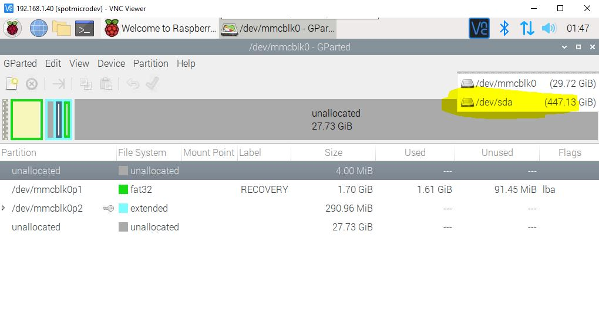

If the partition is not expanded already, make sure you expand it and 
it ends like the following image:

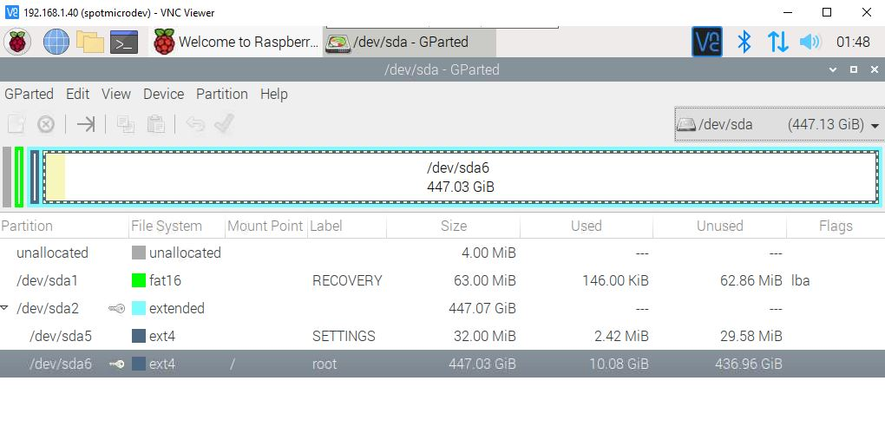

## USB3 Performance

```
sudo apt install hdparm
```

We want to check read and write speeds.

First my results for your reference:

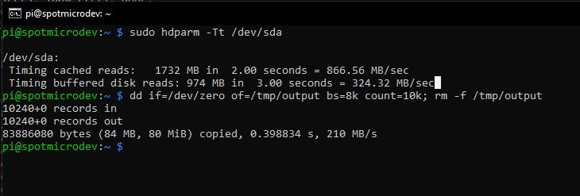

### Read speeds

```
sudo hdparm -Tt /dev/sda
```
### Write speeds

```
dd if=/dev/zero of=/tmp/output bs=8k count=10k; rm -f /tmp/output
```

# Overclock

```
sudo apt update
sudo apt dist-upgrade
sudo rpi-update
```

**Don't use sudo rpi-update as the update normal process**, it reflashes the firmware

```
sudo nano /boot/config.txt
```
under the [pi4] section in the file add
* over_voltage=6
* arm_freq=2000

# PyCharm

Download PyCharm from JetBrains website

Open a terminal and run the following commands

```
sudo apt install default-jdk -y

cd /opt

tar xvzf /home/pi/Downloads/pycharm-professional-XXXX.X.X.tar.gz
rm -rf /home/pi/Downloads/pycharm-professional-XXXX.X.X.tar.gz

cd /opt/pycharm-2019.3.2/bin
./pycharm.sh 
```

Some warnings will appear depending of your java version and configuration.

During the first start, PyCharm will ask you to activate plugins, I did select Markdown only

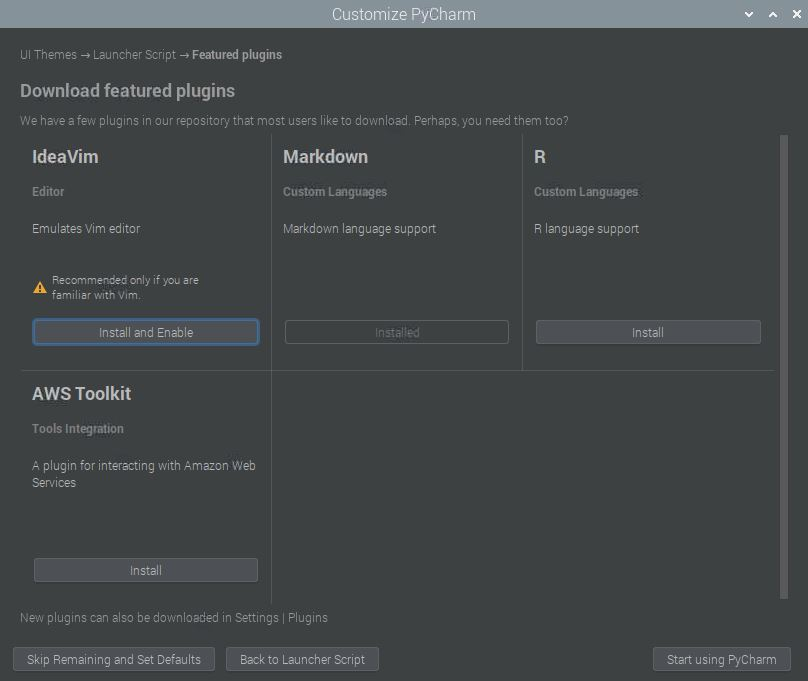

Create a first dummy project in your Desktop folder

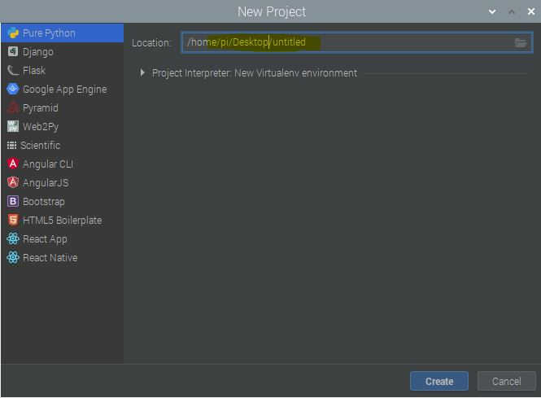

Wait till the environment finishes loading

## PyCharm desktop menu entry

Once the enviroment is loaded, go to Tools -> Create Desktop Entry...

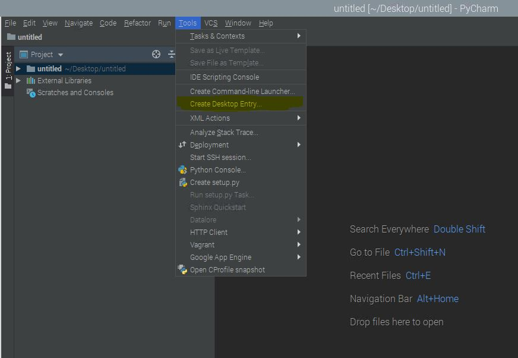

And it will be created and visible under the menu

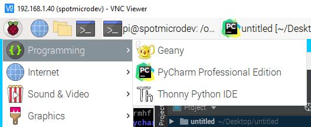

## Fonts

TODO:
* To pic the ones used in windows/macos and pair them
* Disable antialias to check if the text experience improves

# Projects folder and repositories

To get familiar with Python and needed dependencies, follow the instructions and comments here that suit your needs: https://gitlab.com/custom_robots/spotmicro/raspberrypi/tree/master/2.%20Creating%20a%20program%20that%20boots%20when%20SpotMicro%20starts

```
mkdir /home/pi/projects
cd /home/pi/projects

git clone https://gitlab.com/custom_robots/spotmicro/raspberrypi
```

# Overclock

Monitor the temperature in the external screen on boot or the desktop menu bar

```
sudo apt update -y
sudo apt dist-upgrade -y

sudo rpi-update -y

sudo nano /boot/config.txt

```

# Enable I2C if you need it

Make sure you have the I2C interface connected in raspberry, in the Interfacing Options
```
sudo raspi-config
```


# Final notes

Remember you can use FileZilla to pass files between your host pc and the SpotMicro development environment

Or you can just ssh to the box and run the terminal from your local desktop for convenience.